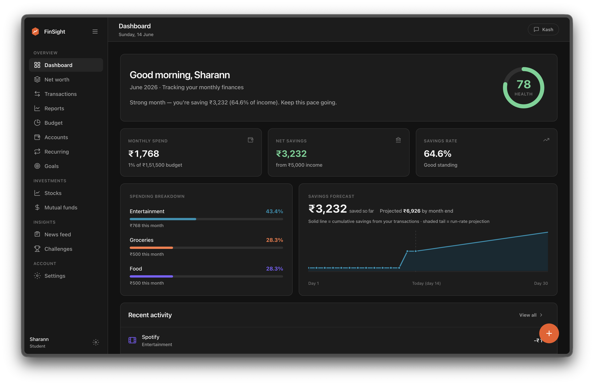
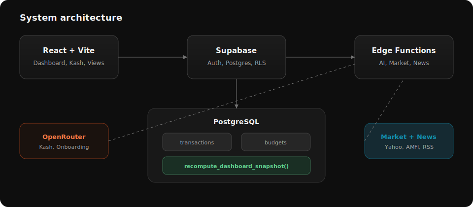

<div align="center">


<br />

[](https://react.dev/)
[](https://vitejs.dev/)
[](https://supabase.com/)
[](https://www.postgresql.org/)
[](.)

<br /><br />

[Features](#features) · [Screenshot](#screenshot) · [Architecture](#architecture) · [Getting started](#getting-started)

</div>

## Screenshot

<p align="center">
  
</p>

## Overview

FinSight is persona-aware personal finance for India. Onboarding adapts to students, salaried professionals, and business owners; default budgets and dashboard framing follow that profile. Every transaction updates budgets server-side, recomputes the dashboard snapshot in PostgreSQL, and keeps **Kash** (the AI copilot) in sync with your real numbers.

Open the app and use **Try live demo** for a full interactive session with no sign-up.

## Features

<table>
<tr>
<td width="50%" valign="top">

**Dashboard**
- Financial health score (0–100) from savings rate and budget adherence
- Monthly spend, net savings, and savings rate vs income
- Personalized briefing, category breakdown, savings forecast
- Leak detector for categories up 25%+ vs last month
- Recent activity feed

**Transactions**
- Manual entry via floating action button
- Natural-language logging through Kash
- Search, filter, sort; recurring pattern detection

**Budgets**
- Per-category monthly limits with progress bars
- Persona-seeded defaults on onboarding complete
- Overall usage warnings at 75% and 90%

**Reports**
- Income, expenses, savings rate, daily average
- Category donut chart and top merchants
- Spending alerts from leak detector

</td>
<td width="50%" valign="top">

**Accounts & net worth**
- Multiple bank accounts with default selector
- Net worth across banks, stocks, mutual funds, assets, liabilities

**Recurring**
- OTT/subscription presets and custom recurring items
- Detection from transaction history

**Investments**
- Stocks: NSE/BSE holdings, live Yahoo Finance quotes
- Mutual funds: AMFI search, NAV, XIRR, benchmark comparison

**Goals & challenges**
- Timeline-based savings targets with progress tracking
- Gamified challenges with XP and preset goals

**News**
- Indian financial news (Mint, ET, Moneycontrol, Google News)
- Personalized ranking from interests, spending, and holdings

**Kash**
- Resizable AI sidebar on every screen
- Context-aware replies; creates transactions from chat
- OpenRouter via edge function; local fallback in demo mode

**Auth & settings**
- Email/password and Google OAuth; RLS on all user data
- Light/dark/system theme; toggle optional modules

</td>
</tr>
</table>

## Architecture

<p align="center">
  
</p>

| Layer | Technology |
|-------|------------|
| Frontend | React 18, Vite 6, light/dark themes |
| Backend | Supabase Auth, PostgreSQL, RLS, Edge Functions |
| AI | OpenRouter via `ai-copilot` and `ai-onboarding` |
| Market data | Yahoo Finance (equities), AMFI NAV (mutual funds) |
| News | LiveMint, Economic Times, Moneycontrol, Google News RSS |

Metrics are computed in PostgreSQL (`recompute_dashboard_snapshot`) and stored in `dashboard_snapshots`. Edge functions: `ai-copilot`, `ai-onboarding`, `market-data`, `news-feed`.

## Getting started

**Prerequisites:** Node.js 18+, a [Supabase](https://supabase.com) project

```bash
npm install
cp .env.example .env.local   # set VITE_SUPABASE_URL and VITE_SUPABASE_ANON_KEY
npm run dev
```

1. Apply `supabase/migrations/001` through `008` in order
2. Deploy edge functions in `supabase/functions/`
3. Set `OPENROUTER_API_KEY` (required) and `SUPABASE_SERVICE_ROLE_KEY` (recommended for news cache)

Use **Try live demo** to explore without Supabase. For production: `npm run build` then `npm run preview`.

## Project structure

```
src/           pages, views, components, lib, context
supabase/      migrations, edge functions
docs/assets/   README branding (logo, banner, architecture SVG)
```

## Data and privacy

- Row Level Security on all user tables (`auth.uid() = user_id`)
- OpenRouter keys only in Edge Function secrets, never in the frontend bundle
- Preferences in `localStorage`; Kash session in `sessionStorage`

<div align="center">
<br />
<sub><strong>FinSight</strong> · built for how Indians earn, spend, and save</sub>
</div>
