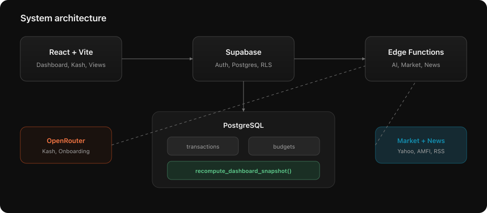

  

<h1 align="center">FinSight</h1>

  <strong>Persona-aware personal finance for India</strong> 
  Track spending, hit savings goals, talk to your money with Kash.

  <a href="#about">About</a> ·
  <a href="#screenshot">Screenshot</a> ·
  <a href="#features">Features</a> ·
  <a href="#architecture">Architecture</a> ·
  <a href="#security">Security</a>

## About

FinSight is a full-stack personal finance platform built for how people in India actually earn, spend, and save. Instead of a one-size-fits-all dashboard, the app adapts to your profile — student, salaried professional, or business owner — and tailors onboarding, default budgets, and insights accordingly.

Log a transaction once and it flows everywhere: budgets update, reports refresh, and your financial health score recalculates. Ask **Kash**, the built-in AI copilot, questions in plain language or type *"I spent ₹500 on groceries"* — no forms required.

**Try it:** open the app and select **Try live demo** for a full walkthrough with no account needed.

## Screenshot

  

  Dashboard with health score, monthly metrics, spending breakdown, savings forecast, and recent activity.

## Features

<table>
<tr>
<td width="50%" valign="top">

**Dashboard & insights**
- Financial health score driven by savings rate and budget discipline
- Monthly spend, net savings, and savings rate at a glance
- Category breakdown, savings forecast, and spending leak detection
- Persona-aware briefing that updates with every transaction

**Money in & out**
- Manual transaction entry or natural-language logging via Kash
- Searchable ledger with filters, sorting, and recurring detection
- Category budgets with progress bars and over-limit warnings
- Reports with donut charts, top merchants, and monthly summaries

</td>
<td width="50%" valign="top">

**Wealth & investments**
- Bank accounts and consolidated net worth view
- Stock portfolio with live NSE/BSE quotes
- Mutual fund tracker with AMFI search, NAV, and returns
- Savings goals, spending challenges, and recurring expense management

**Intelligence**
- **Kash** — context-aware AI copilot across every screen
- Personalized financial news from Indian sources
- Onboarding questionnaire that seeds budgets to your profile
- Light and dark themes; modular feature toggles in settings

</td>
</tr>
</table>

## Kash

Kash is FinSight's AI assistant. It reads your current dashboard snapshot and recent transactions before every reply, so answers reflect your real finances — not generic advice.

| Capability | Detail |
|------------|--------|
| Natural-language logging | *"Paid ₹299 for Spotify"* → categorized and saved automatically |
| Spending questions | Ask about categories, savings pace, or where money is leaking |
| Always available | Resizable sidebar panel on every view in the app |
| Secure by design | AI runs server-side; API keys never reach the browser |

## Architecture

  

FinSight is a React single-page application backed by Supabase. User data lives in PostgreSQL with row-level security. Dashboard metrics are computed server-side and cached as snapshots, so the UI stays fast even as transaction history grows.

| Layer | Stack |
|-------|-------|
| Client | React 18, Vite, responsive light/dark UI |
| Backend | Supabase Auth, PostgreSQL, Edge Functions |
| AI | Kash copilot and onboarding via OpenRouter |
| Market data | Yahoo Finance (equities), AMFI India (mutual fund NAV) |
| News | Curated RSS from Mint, Economic Times, Moneycontrol, Google News |

## Security

FinSight is built with data isolation as a default, not an afterthought.

- Every user table is protected with PostgreSQL Row Level Security
- Authentication via email/password or Google OAuth
- AI and third-party API keys are stored in server-side secrets only
- Financial data is scoped per user — no cross-account access

  <strong>FinSight</strong> · built for how Indians earn, spend, and save

